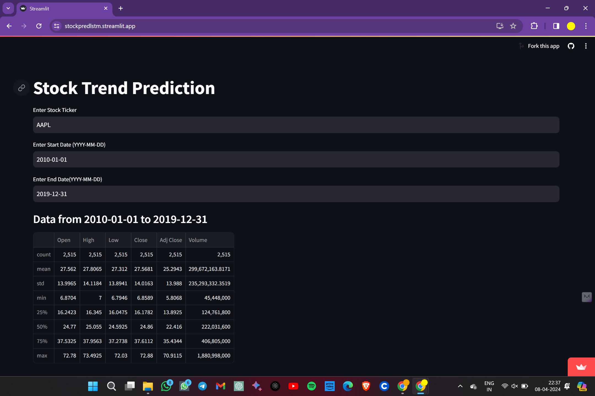
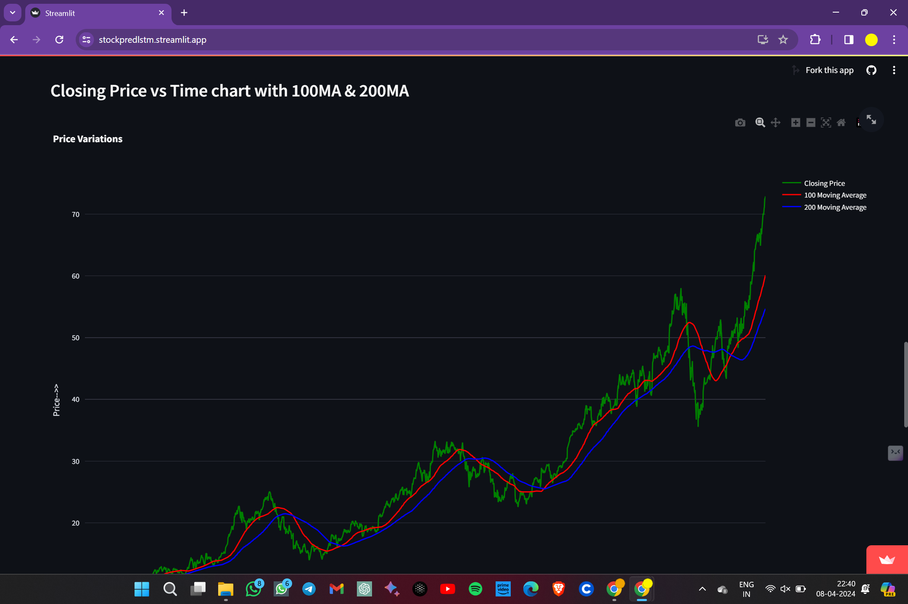
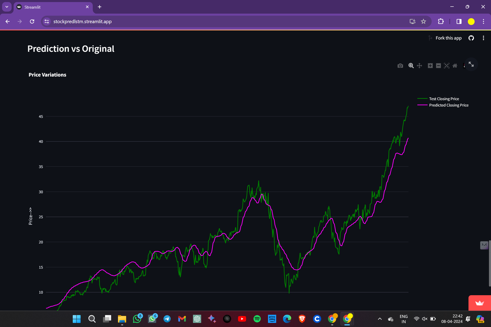
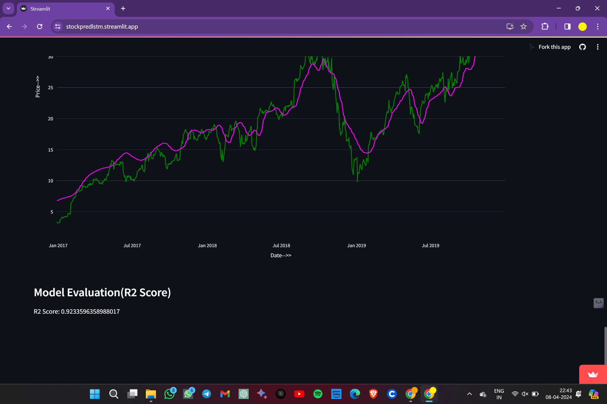

## Stock Trend and Price Prediction using Deep Learning Model (Using a sequence Model "LSTM: Long Short Term Memory Network")

## Prediction of the stocks trend and closing price

### Introduction About the Data :

**The dataset** We are directly fetching from the `yfinance` API. We can fetch any stocks data using their specific `STOCK TICKER NAME` (`eg Apple:AAPL', Netflix: NFLX`) 

This data set from the `yfinance` consists of the following columns.

* `Date` : 
* `Open` : 
* `High` : 
* `Low` : 
* `Close` : 
* `Adj Close` : 
* `Volume` : 

Target variable:
Our target is to predict the `Closing Price` of the stock and also predict the trend of the stock.

# Approach for the project 

1. Data Ingestion : 
    * In Data Ingestion phase the data is first fetch from `yfinance` and coverted into the `pandas dataframe` 
    * Plotted Some basic `plotly` and `matplotlib` charts for the `closing price vs date` along with some different moving averages `100 ma` & `200 ma`  
    * Then the `closing price` data is `split` into training and testing and `by following the time series principles`.
    
2. Data Transformation : 
    * In this phase a the data is transformed using `MinMaxScaler`.

3. Model Training : 
    * `LSTMS (A Sequential Model)` is defined using `keras` sequential model for training. 
    * For the regularization `Dropout` is defined
    * After finishing the training, trained model is saved in `keras.h5` format

4. Prediction of the Time series : 
    * Now model is utilized to predict the time series (sequential closing price of the stock)

5. Flask App creation : 
    * Streamlit app is created with User Interface to predict stock trend and closing price inside a Web Application.

## Model Training Approach Notebook

Link : [Model Training LSTM Notebook](./LSTM_Network.ipynb)

# Streamlit WebApp Deployment:

Streamlit link : [https://stockpredlstm.streamlit.app/]

# Screenshots of UI

Feeding Stock Ticker Name and choosing the Time Frame:

Chart:

### Predcted closing price vs Original closing price:

Evaluation Metric R2_Score:

